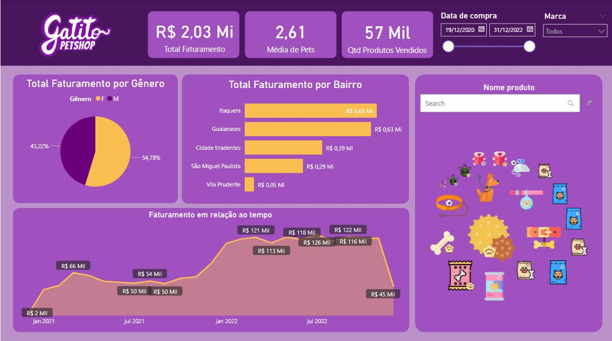

# Power-BI

<b> PT-BR </b>  
Projeto que simula um Petshop onde a dona pediu detalhes que necessitava para tomada de decisão como por exemplo:

- Faturamento total
- Média de pets para cada pessoa
- Quantidade de produtos vendidos
- Faturamento por bairro (ela deseja abrir outra loja)
- Faturamento por gênero

-------------------------------------------------------------------------

<b> EN-US </b>  
Project that simulates a Petshop where the owner asked for details she needed to make a decision, such as:

- Total revenue
- Average number of pets for each person
- Quantity of products sold
- Revenue by neighborhood (she wants to open another store)
- Billing by gender

 
